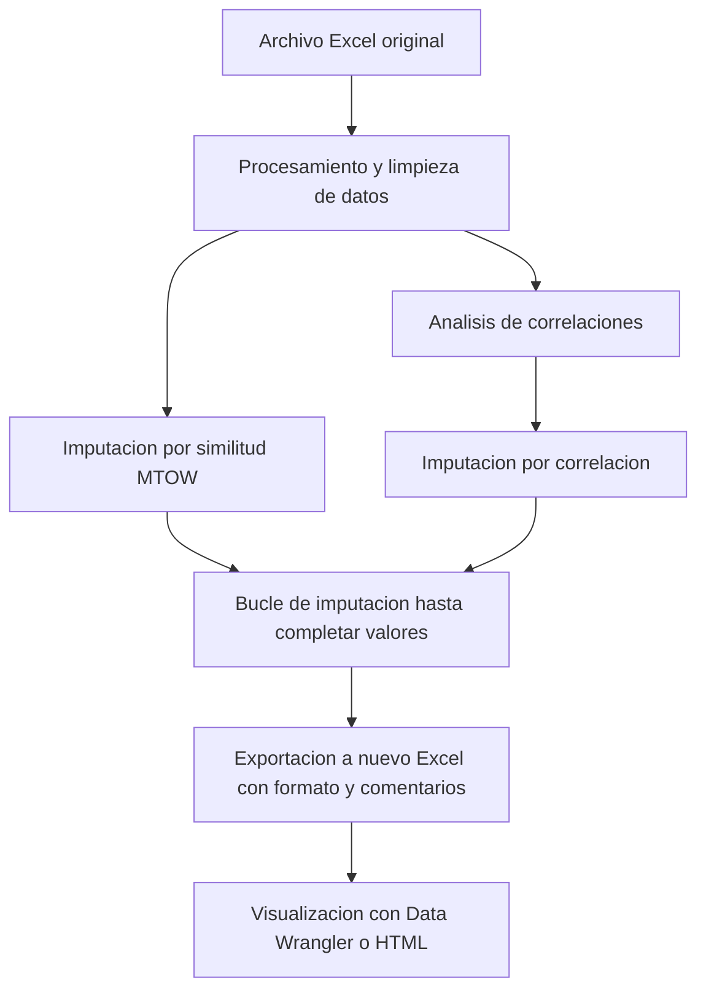
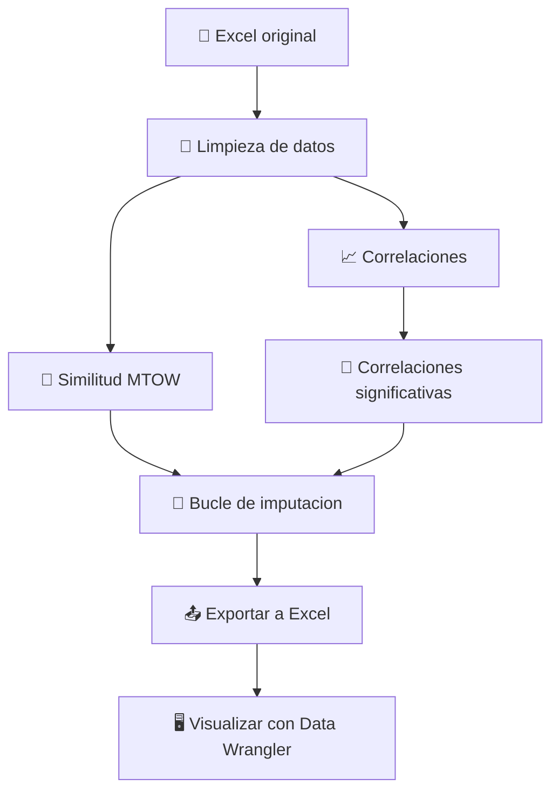

# 📊 Diagrama de flujo de datos - Proyecto ADRpy

Este diagrama representa el flujo principal de los datos en el proceso de análisis e imputación de aeronaves.





```mermaid
graph TD
    classDef inicio fill=#cce5ff,stroke=#004085,color=#004085,stroke-width:2px;
    classDef proceso fill=#e2e3e5,stroke=#383d41,color=#383d41;
    classDef importante fill=#fff3cd,stroke=#856404,color=#856404,stroke-width:2px;
    classDef salida fill=#d4edda,stroke=#155724,color=#155724;

    A[📁 Excel original]:::inicio --> B[🧹 Limpieza de datos]:::proceso
    B --> C[📈 Correlaciones]:::proceso
    B --> D[🧮 Similitud MTOW]:::proceso
    C --> E[🔗 Correlación significativa]:::importante
    D --> F[🔁 Bucle de imputación]:::importante
    E --> F
    F --> G[📤 Exportación Excel]:::salida
    G --> H[🖥️ Visualización HTML o Data Wrangler]:::salida

---

## 📌 Notas:
- Cada bloque representa una etapa clave del proyecto.
- Las flechas indican la evolución del DataFrame a través de funciones.
- Las funciones clave están agrupadas en módulos dentro de la carpeta `Modulos`.

