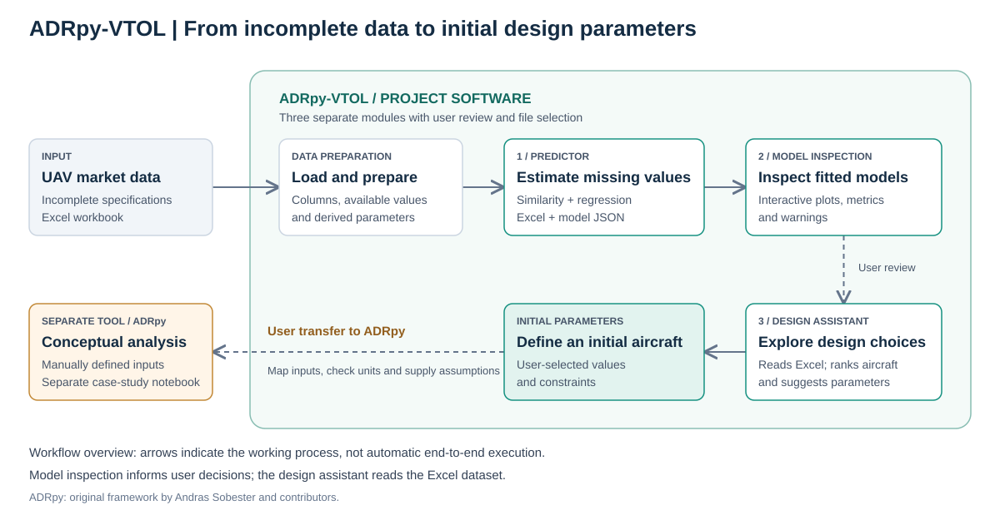

# ADRpy-VTOL — UAV Data Imputation and Conceptual Design Assistance

An academic Python system for estimating missing UAV parameters, inspecting statistical models, and supporting the selection of initial parameters for subsequent conceptual analysis with ADRpy.

Public UAV specifications are often incomplete and difficult to compare. Developed by **Ezequiel Delpino** as an Aeronautical Engineering final-degree project, ADRpy-VTOL combines statistical estimation with interactive tools to help an engineer explore that data and choose initial aircraft parameters.

## My final-degree project additions

I developed three complementary modules around a UAV market dataset:

| Module | What it does | Implementation |
| --- | --- | --- |
| **1. Predictor / imputation engine** | Estimates missing values through similarity and regression; exports a partially completed dataset and information about individual estimates. | [`ADRpy/analisis/Modulos/`](ADRpy/analisis/Modulos/) |
| **2. Model analysis and visualization** | Provides an interactive dashboard to inspect fitted relationships, metrics, training data and warnings. | [`Analisis_modelos/`](ADRpy/analisis/Modulos/Analisis_modelos/) |
| **3. Conceptual design assistant** | Compares aircraft against user-defined constraints, explores trends and suggests parameter values for an initial design. | [`asistente_diseno/`](ADRpy/asistente_diseno/) |

*The diagram shows the working process. The modules are launched separately, with user review and file selection between stages; they do not form a fully automated end-to-end pipeline.*

## Implemented methods

- **Similarity-based imputation:** estimates from comparable aircraft using shared parameters and weighted neighbors.
- **Regression-based estimation:** linear, quadratic, logarithmic, exponential and power-law models with one predictor; linear and quadratic models with two predictors.
- **Model assessment:** R² and MAPE, LOOCV routines, sample-size and model-quality checks, outlier handling, and multicollinearity and geometric checks for two-predictor fits. LOOCV does not validate every model family consistently; see the [technical limitations](ADRpy/analisis/README.md#known-limitations).
- **Reviewable outputs:** Excel and JSON records containing individual estimates and model information, an interactive model-analysis dashboard, and design-assistance reports with structured parameter definitions.

This is an academic research implementation. Missing values may remain unresolved, confidence scores are heuristic, and traceability varies by output. Suggested values require engineering review; the software does not automatically establish their physical validity.

## Relationship to ADRpy and attribution

**Original ADRpy framework — Andras Sobester and contributors.** [ADRpy](https://github.com/sobester/ADRpy) supplies aircraft conceptual-design and performance-analysis tools. Its code and original attribution are retained in this repository; they are distinct from my final-degree project additions above. See the [original ADRpy documentation](https://adrpy.readthedocs.io/en/latest/), [PyPI package](https://pypi.org/project/ADRpy/), and [preserved upstream README](docs/upstream/README-ADRpy.md), including its examples and tutorial links. The existing [GNU GPL v3 license](LICENSE.md) is unchanged.

**ADRpy-VTOL operates upstream of ADRpy.** It helps derive and organize initial aircraft parameters. The user must select values, check units and assumptions, and enter the relevant inputs into ADRpy for subsequent conceptual analysis. The design assistant does not automatically feed or launch ADRpy.

A separate [ADRpy case-study notebook](docs/ADRpy/notebooks/ADRpy_Tesis_Delpino.ipynb) demonstrates conceptual constraint analysis using manually defined inputs. It is independent of the three-module workflow and is not a complete VTOL flight-envelope analysis.

## Explore the project

- [Technical guide](ADRpy/analisis/README.md): structure, entry points, inputs and outputs, statistical methods, setup status and known limitations.
- [Project notebooks](ADRpy/notebooks/): the predictor, model-analysis and design-assistant interfaces. Existing local paths need adjustment before use; these are not a verified one-command setup.
- [Thesis and condensed technical paper](docs/thesis/README.md): academic context and original Spanish documents.

The public documentation is in English. Internal code names, dataset columns and historical material retain their original Spanish naming.
